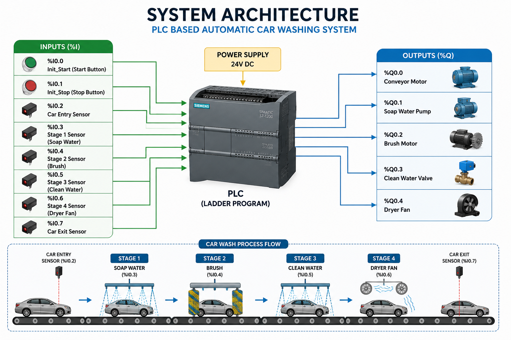
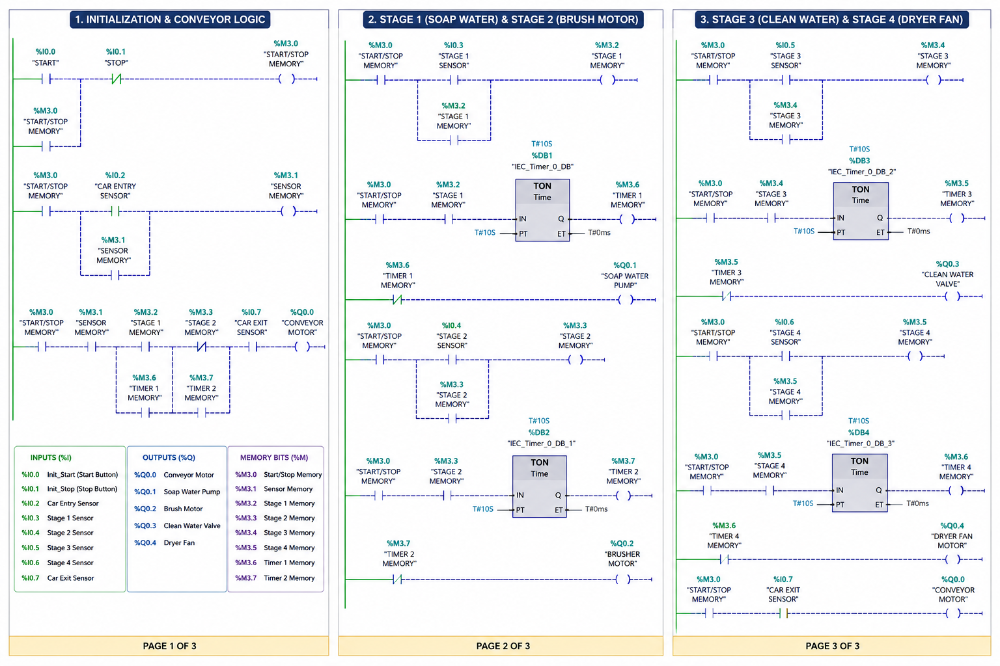

# 🚗 PLC-Based Automatic Car Washing System

## Overview

This project automates a car washing process using PLC ladder logic. The conveyor automatically moves the vehicle through four washing stages controlled by IR sensors and timers.

---

## Features

- Automatic Car Detection
- Conveyor Motor Control
- Soap Water Spray
- Rotating Brush
- Clean Water Rinse
- Dryer Fan
- Automatic Stop after Exit

---

## Hardware Used

- PLC
- IR Sensors
- Conveyor Motor
- Soap Water Pump
- Brush Motor
- Water Valve
- Dryer Fan
- Power Supply

---

## Inputs

| Address | Description |
|----------|-------------|
| %I0.0 | Init Start |
| %I0.1 | Stop |
| %I0.2 | Car Entry Sensor |
| %I0.3 | Stage 1 Sensor |
| %I0.4 | Stage 2 Sensor |
| %I0.5 | Stage 3 Sensor |
| %I0.6 | Stage 4 Sensor |
| %I0.7 | Car Exit Sensor |

---

## Outputs

| Address | Description |
|----------|-------------|
| %Q0.0 | Conveyor Motor |
| %Q0.1 | Soap Water Spray |
| %Q0.2 | Brush Motor |
| %Q0.3 | Clean Water Valve |
| %Q0.4 | Dryer Fan |

---

## Memory Bits

| Address | Description |
|----------|-------------|
| %M3.0 | Initialization |
| %M3.1 | Entry Memory |
| %M3.2 | Stage 1 |
| %M3.3 | Stage 2 |
| %M3.4 | Stage 3 |
| %M3.5 | Stage 4 |

---

## Working Principle

### Initialization

Press **Init Start (%I0.0)** to initialize the PLC. Once the car is detected at the entry sensor (%I0.2), the conveyor motor starts and the internal memory bits latch the process.

### Stage 1 – Soap Water

When the car reaches Stage 1 (%I0.3):

- Conveyor stops
- Soap water spray turns ON
- Timer T1 runs for 10 seconds
- Conveyor resumes

### Stage 2 – Brush

When the car reaches Stage 2 (%I0.4):

- Conveyor stops
- Brush motor rotates
- Timer T2 runs for 10 seconds
- Conveyor resumes

### Stage 3 – Clean Water

When the car reaches Stage 3 (%I0.5):

- Conveyor stops
- Clean water valve opens
- Timer T3 runs for 10 seconds
- Conveyor resumes

### Stage 4 – Dryer

When the car reaches Stage 4 (%I0.6):

- Conveyor stops
- Dryer fan starts
- Timer T4 runs for 10 seconds
- Conveyor resumes

### Exit

When the car reaches the exit sensor (%I0.7):

- Conveyor motor stops
- Process completed

---

## Project Images

### System Architecture

### PLC Ladder Logic

---

## Working Video

(Working demonstration  Video 2026-06-26 at 9.23.04 PM.mp4)

---
PLC-Based-Car-Wash-System
│
├── README.md
├── Images
│      system_architecture.png
│      ladder_logic.png
│      plc_program.png
│
├── Documentation
│      Project_Report.pdf
│
├── PLC Program
│      CarWash.ap17
│
└── Video
       Working_Demo.mp4
## Author

Supreet Hulloli

Electrical & Electronics Engineering Student
